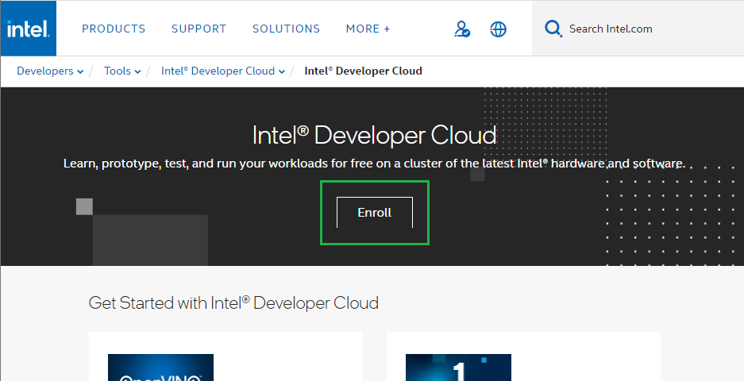
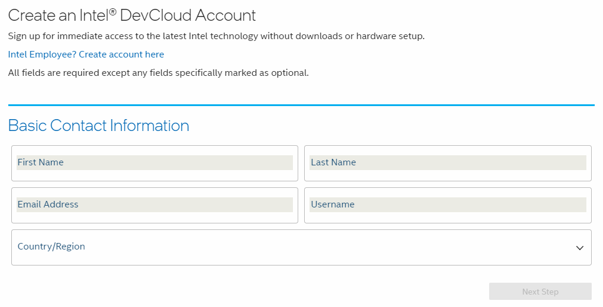
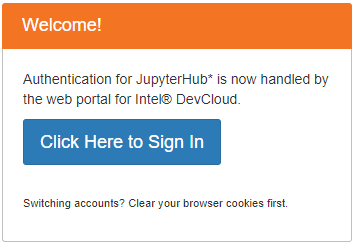
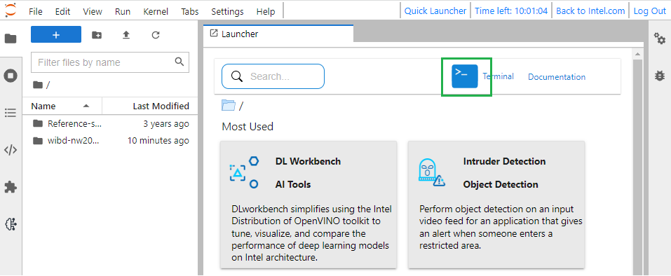
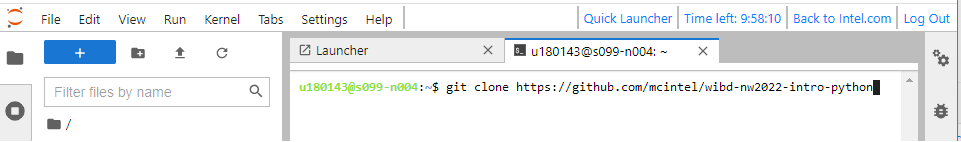
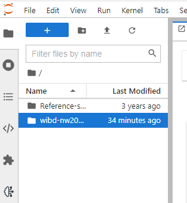
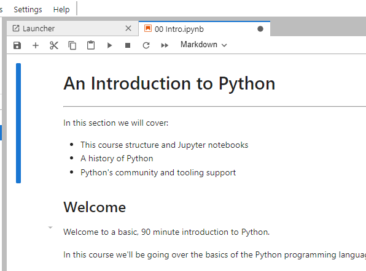

# Women in Big Data: Introduction to Python - 2022 Northwest Conference

This repository holds Juptyper notebooks for a introduction to Python training session given at the Women in Big Data 2022 Northwest Conference.

## Setup steps:
Do the follow steps to set up this training material:

**Step 1:** Create an account with [Intel&reg; DevCloud](https://www.intel.com/content/www/us/en/developer/tools/devcloud/overview.html).





**Step 2:** Go to https://notebooks.edge.devcloud.intel.com/hub/login and sign in.



**Step 3:** Open a terminal window and clone this repository.





```
git clone https://github.com/stutihar/WiBD-PythonWorkshop2022.git
```

**Step 4:** Navigate to and open the "OO Intro" notebook




